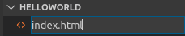
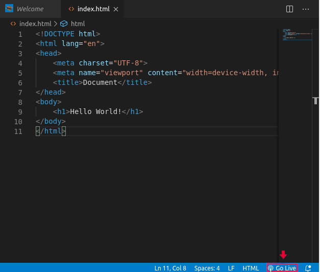
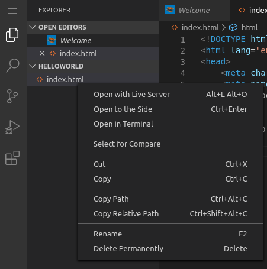

# Criando sua Primeira Página Web e Visualizando-a

Agora vamos criar uma página Web utilizando HTML e visualizá-la em um browser integrado ou em qualquer browser instalado em seu computador utilizando a extensão Live Server.  

# Criando sua primeira página Web: index.html no VS Code

2.1. No VS Code Explorer, na área HELLOWORLD, clicar no ícone referente a "Novo Arquivo". Em seguida, digite o nome do seu arquivo de código HTML: index.html e tecle ENTER.




2.2. Agora, dentro do arquivo HTML aberto no VS Code, digite "html" e utilize a sugestão Emmet Abbreviation "html:5", selecionando-a. O código padrão HTML5 é gerado automaticamente. O código gerado é o mesmo mostrado abaixo. Em seguida, tecle CTRL+S para salvar o arquivo, ou salve-o acessando o ícone de menu no canto superior esquerdo e, em seguida, no menu "File" clique na opção "Save".

```html
<!DOCTYPE html>
<html lang="en">
<head>
    <meta charset="UTF-8">
    <meta name="viewport" content="width=device-width, initial-scale=1.0">
    <title>Document</title>
</head>
<body>
    
</body>
</html>
``` 

2.3. Altere o código, colocando entre as tags "BODY" o trecho de código "<"h1">" Hello World! "<"/h1">", sem as aspas, de forma a mostrarmos na nossa primeira página HTML a frase "Hello World!", ao ser visualizada em um browser. O código no arquivo final no VS Code deverá ficar como mostrado na figura abaixo. Lembre-se, também, de confirmar que a extensão do arquivo é .html

```html
<!DOCTYPE html>
<html lang="en">
<head>
    <meta charset="UTF-8">
    <meta name="viewport" content="width=device-width, initial-scale=1.0">
    <title>Document</title>
</head>
<body>
    <h1>Hello World!</h1>
</body>
</html>
``` 

# Visualizando sua primeira página Web em um Browser

2.4. Vamos visualizar a nossa primeira página web até o momento. Clique na opção "Go Live" da extensão Live Server que aparece no canto inferior direito da janela de edição do seu código HTML ou clique com o botão direito do mouse no seu arquivo index.html no VS Code Explorer e, em seguida, escolha a opção "Open With Live Server", conforme mostrado nas figuras abaixo.





A extensão Live Server cria um "Servidor Web" com a pasta do seu projeto Hello World sendo a pasta root deste servidor e abre uma janela de aviso informando a porta em que o Servidor Web está disponibilizando o serviço web: 5500. Feche esta janela de aviso.


2.5. Para visualizar sua primeira página web clique na "Web Browser Tab" para testar sua página na mesma janela do seu navegador já aberto ou clique na "Web Browser Placeholder Tab" para testar sua página em outra janela do seu navegdor padrão ou copie a URL gerada pela "Web Browser Placeholder Tab" para testar em outro navegador no seu dispositivo/computador. Caso necessário, informe a porta disponibilizada pelo Live Server: 5500 e clique no botão "Display Port" na "Web Browser Tab".


A sua primeira página deverá se parecer com a página abaixo.


