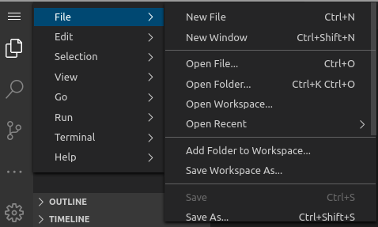

# Criando diretórios para os projetos C++ e para o projeto HelloWorld utilizando comandos de Shell Linux

1.1. Crie um diretório chamado c++_projects utilizando o terminal.

`mkdir c++_projects`{{execute}}

1.2. Entre no diretório de projetos C++ criado e crie uma pasta para o projeto Hello World.

`cd c++_projects`{{execute}}

`mkdir helloworld`{{execute}}

# Abrindo o diretório do projeto Hello World no VS Code

1.3. No VS Code, clique no ícone de menu no canto superior esquerdo e, em seguida, clique na opção Open Folder, conforme imagem abaixo.

