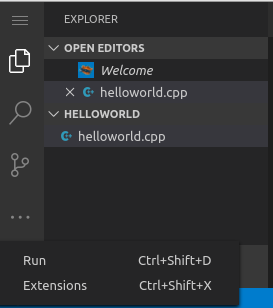
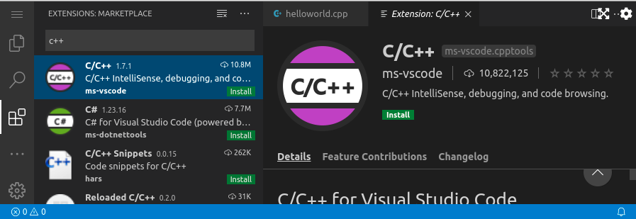
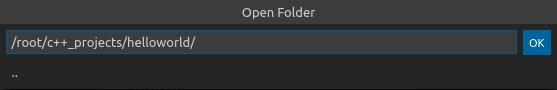
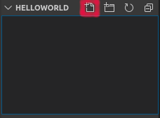
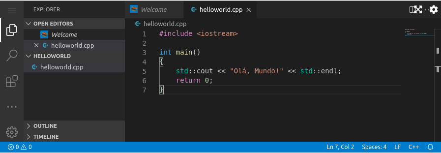

# Instalar a Extensão C/C++

1.1. No VS Code, clique no ícone de três pontos no menu lateral direito para acessar mais opções do menu e, em seguida, clique na opção "Extensions".



1.2. Em "EXTENSIONS: MARKETPLACE", pesquise por "c++", selecione e instale a extensão C/C++ clicando em "Install".



Quando a instalação terminar, clique na opção "Reload Required", para reiniciar o VS Code.

# Criando diretórios para os projetos C++ e para o projeto HelloWorld utilizando comandos de Shell Linux

1.3. Crie um diretório chamado c++_projects utilizando o terminal.

`mkdir c++_projects`{{execute}}

1.4. Entre no diretório de projetos C++ criado e crie uma pasta para o projeto Hello World.

`cd c++_projects`{{execute}}

`mkdir helloworld`{{execute}}

# Abrindo o diretório do projeto Hello World no VS Code

1.5. No VS Code, clique no ícone de menu no canto superior esquerdo e, em seguida, no menu "File" clique na opção "Open Folder...", conforme imagem abaixo.


1.6. Na janela Open Folder, insira o caminho para o projeto Hello World: /root/c++_projects/helloworld/ e clique em OK. No VS Code Explorer irá aparecer uma área referente ao diretório helloworld aberto: HELLOWORLD.



1.7. No VS Code Explorer, na área HELLOWORLD, clicar no ícone referente a "Novo Arquivo". Em seguida, digite o nome do seu arquivo de código C++: helloword.cpp e tecle ENTER.




1.8. Agora, digite o código do Hello World abaixo no seu arquivo aberto ou copie e cole dentro do arquivo. Em seguida, tecle CTRL+S para salvar o arquivo, ou salve-o acessando o ícone de menu no canto superior esquerdo e, em seguida, no menu "File" clique na opção "Save".

```cpp
#include <iostream>

int main()
{
    std::cout << "Olá, Mundo!" << std::endl;
    return 0;
}
``` 

O código no arquivo final no VS Code deverá ficar como mostrado na figura abaixo. Lembre-se, também, de confirmar que a extensão do arquivo é .cpp



