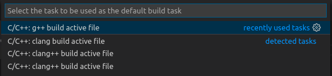
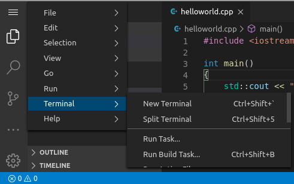
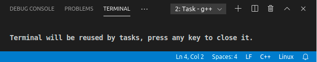
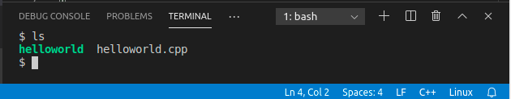

# Configurando a tarefa de compilação do código C++

Agora, vamos criar o arquivo tasks.json que conterá as instruções para o VS Code buildar (compilar) o programa que escrevemos no arquivo helloworld.cpp. Esta tarefa irá chamar o compilador g++ (do GNU Compiler Collection) para criar um arquivo executável a partir do código fonte.

É importante ter o helloworld.cpp aberto no editor devido ao próximo passo utilizar o arquivo ativo no editor para o contexto da criação da tarefa de compilação.

2.1. No menu principal, no lado direito, escolha "Terminal" e, em seguida, a opção "Configure Default Build Task". Um menu dropdown aparece mostrando várias tarefas pré-definidas de compilação de compiladores C++. Escolha "C/C++: g++ build active file".

Isto irá criar o arquivo tasks.json na pasta .vscode e o abrirá no editor.

# Compilando o helloworld.cpp

2.2. Volte para o arquivo helloworld.cpp. Sua tarefa compila o arquivo ativo no VS Code e você quer compilar o helloworld.cpp.

2.3. Antes de rodar a tarefa, abra um terminal em um Painel de Terminal Integrado do VS Code. Vá no menu principal e, na opção "Terminal", escolha "New Terminal".

2.4. Para rodar a tarefa de compilação definida no tasks.json, execute Ctrl+Shift+B ou no menu Terminal, escolha a opção "Run Build Task...".

Quando a tarefa se inicia, você deverá ver uma mensagem gerada em um segundo terminal no Painel de Terminal Integrado aberto quando você executou o passo anterior. Esta mensagem vem do compilador e indica se a compilação foi bem-sucedida ou falhou. Caso tenha sido bem-sucedida a mensagem será parecida com a da imagem abaixo. 

2.5. Pressione qualquer tecla para voltar para o terminal integrado 1 e insira o comando ls para verificar o arquivo executável helloworld, resultado da compilação pelo G++.

`ls`{{copy}}

O resultado deverá se parecer com a da imagem abaixo.

2.6. Agora, execute o seu primeiro programa executável, Hello World, em C++ compilado, inserindo o seguinte comando no terminal integrado.

`./helloworld`{{copy}}

O resultado deverá se parecer com a da imagem abaixo. O programa Hello World imprime a frase "Olá, Mundo!" no terminal integrado do VS Code. 

