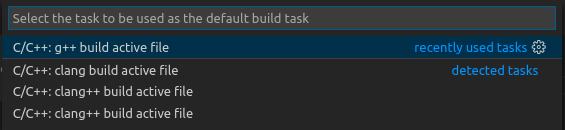
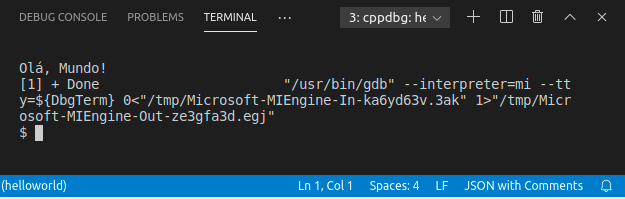

# Instalando o GDB no Ubuntu

Para a tarefa de execução e debug do programa executável helloworld gerado pelo compilador, precisamos ter o GNU Project Debugger (GDB) instalado no Ubuntu. Para isso, insira o comando abaixo no terminal e, quando solicitado, insira "Y" e tecle "ENTER" para continuar.

`sudo apt install gdb`{{execute}}

# Configurando a tarefa de execução e debug do código C++

Com o GDB instalado, vamos criar o arquivo launch.json que conterá as instruções para o VS Code executar e debugar (debug) o programa helloworld, gerado pelo compilador G++. Esta tarefa irá chamar o GDB para executar o programa debugando-o.

Volte para o arquivo helloworld.cpp aberto no editor.

3.1. No menu principal, no lado direito, escolha "Run" e, em seguida, a opção "Add Configuration...". Um menu dropdown aparece para selecionar o Enviromment. Escolha "C++ (GDB/LLDB)".

Também, escolha "C/C++: g++ build active file".

Isto irá criar o arquivo launch.json na pasta .vscode e o abrirá no editor.

No Terminal Integrado, irá abrir uma aba referente ao Debug Console, mostrando o resultado do debug que deverá se parecer com a imagem abaixo, mostrando que a execução ocorreu normalmente.

Por fim, clique na aba Terminal no Terminal Integrado para verificar a saída da execução do programa helloworld pelo GDB.

Note que a saída é conforme programamos, imprimindo a frase "Olá, Mundo!" no terminal.
